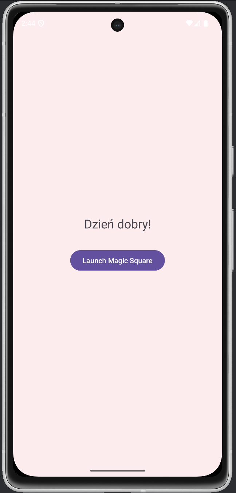
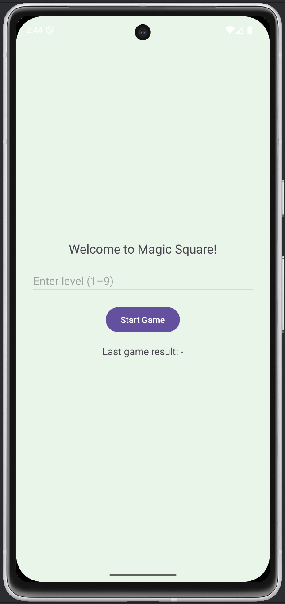
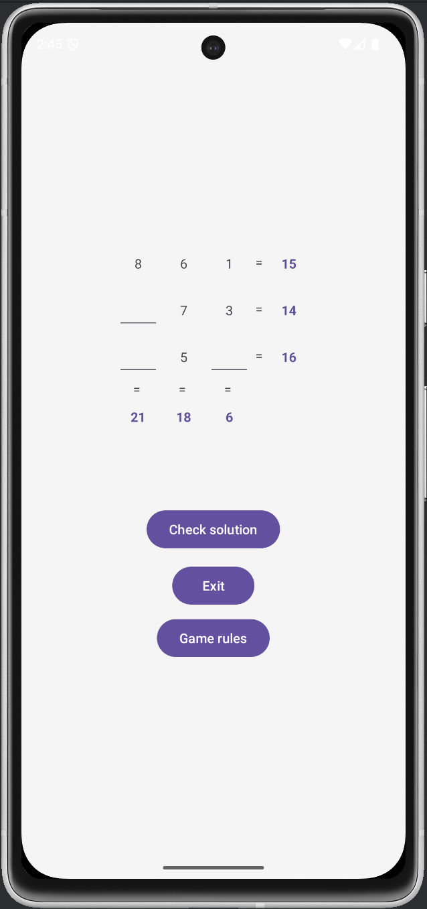

# Magic Square Game

A simple Android game for practicing logic and arithmetic using a 3×3 magic square.

## Description

The goal of the game is to arrange the digits from **1 to 9** in a 3×3 grid so that the **sum of each row and each column** matches the number shown at the end of that row or column. Depending on the selected difficulty level, some of the cells are hidden and must be filled in manually by the player.

## Game Rules

- You must use **each digit from 1 to 9 exactly once**
- The grid must satisfy the **sum of each row and column**
- Diagonals are **not** considered
- All numbers must be **unique and within the range 1–9**
- The game is solved only if all values are filled correctly and all sums match

For more: [Magic Square – Wikipedia](https://en.wikipedia.org/wiki/Magic_square)

---

##  Features

- Three distinct activities:
  - **HomeActivity** – greeting screen with `"Dzień dobry!"`
  - **MagicSquareHomeActivity** – level selection (1–9) and previous game result
  - **MagicSquareActivity** – core logic, interactive grid and feedback
- Difficulty levels control how many fields are hidden
- Validates all input:
  - Values must be 1–9
  - No duplicates
  - All fields must be filled
  - Row and column sums must match
- Game state preserved during screen rotation
- Button to open Wikipedia with game rules
- Visually clear layout with colored, bold sums and symbols `"="`
- Final result (`Success` or `Failed`) shown after exiting the game

---
## How to Run the App

### Clone the project from GitHub and open in Android Studio:

1. Open **Android Studio**
2. Select **"Get from VCS"** on the welcome screen  
   *(or go to `File > New > Project from Version Control...`)*
3. In the **URL field**, paste the repository URL:

```bash
https://github.com/olivblvck/MagicSquare.git
```
4. Choose a local directory where the project should be saved
5. Click **"Clone"**
6. Wait for **Gradle Sync** to complete
7. Connect a physical Android device or start an emulator
8. Click ▶ **Run** or press **Shift + F10**
 
---

## How to Play

1. Launch the app
2. Enter a level (1–9) and press **Start**
3. Fill in the empty cells with numbers from 1–9
4. Tap **"Check solution"** to validate your grid
5. If correct, you’ll see a congratulatory message
6. Press **"Exit"** to return to the previous screen and view your result

---

## Screenshots

| HomeActivity | MagicSquareHomeActivity | MagicSquareActivity |
|--------------|--------------------------|----------------------|
|  |  |  |

---

## Technical Overview

- Java (Android SDK)
- Android Studio Project Structure
- Grid-based UI with `GridLayout`
- Activity-to-activity communication using `Intent` and `setResult()`
- State preservation with `onSaveInstanceState()`
- Custom runtime logic for validation and grid generation
- Clean architecture with clear separation of concerns

---
